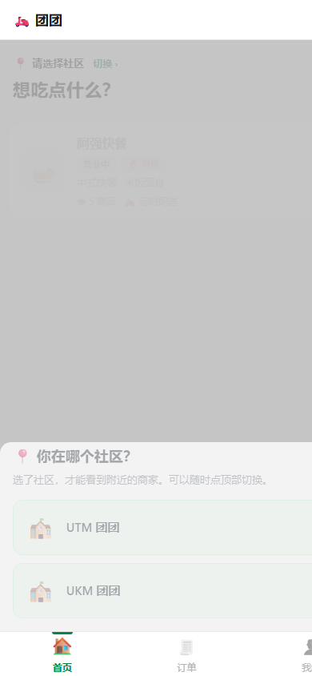
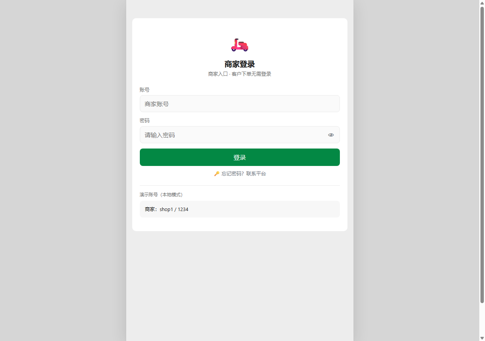
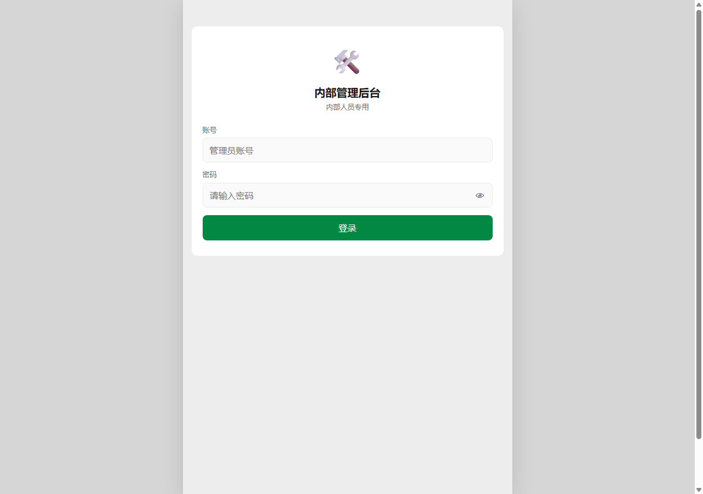

# 团团外卖 · TuanTuan Delivery

[](https://web.dev/progressive-web-apps/)
[]()
[]()

> **校园/社区里给小商家用的外卖工具**。零成本搭建，10 分钟上线，一台手机就能接单。
>
> Campus food delivery platform for small merchants — **zero commission**, zero setup cost, PWA-powered.

---

## 📸 Live Demo

🔗 **[Launch Demo →](https://katherine101001.github.io/tuan-tuan-delivery/)**

### 🧑 Customer — Ordering Interface
[`index.html`](index.html) — Browse menu, place orders, track delivery

<p align="center">
  
</p>

### 🏪 Merchant — Order Management
[`merchant.html`](merchant.html) — Accept/reject orders, CRM, menu management

<p align="center">
  
</p>

### 🛡️ Admin — Platform Control
[`admin.html`](admin.html) — Platform overview, merchant onboarding

<p align="center">
  
</p>

> ⚠️ This demo runs in **offline/demo mode** (`?demo`). All data stored in localStorage — no backend needed.

---

## 👥 Three User Roles

### 🧑 Customer
- Browse menu with search, place orders, track status in real-time
- PWA: install to home screen, works offline
- Contact merchant via in-app chat

### 🏪 Merchant
- Accept/reject incoming orders with sound alerts
- Menu CRUD, CRM dashboard, revenue tracking
- Real-time polling with audio ringer

### 🛡️ Admin
- Platform-wide dashboard & metrics
- Merchant onboarding & management

---

## 💰 Business Model

| Role | Cost |
|------|------|
| Customers | **Free**, no commission |
| Merchants | Basic RM 29/mo · Pro RM 39/mo |
| Platform | **RM 0** — GitHub Pages + GAS + Cloudflare |

---

## 🏗️ Architecture (Production)

```
Customer PWA ──▶ Google Apps Script ──▶ Google Sheets (DB)
                       │
Merchant PWA ──────────┤
                       │
Admin Web ─────────────┘
```

- **Frontend**: Vue 3 + Vanilla JS PWA with service worker
- **Backend**: Google Apps Script (serverless, free)
- **Database**: Google Sheets
- **Hosting**: GitHub Pages + Cloudflare CDN

---

## 📝 Note

This repo contains the **frontend demo only**. Full production system includes GAS backend + worker scripts (proprietary).

---

## 👤 Author

**Katherine** — [@katherine101001](https://github.com/katherine101001)
